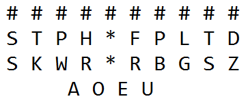
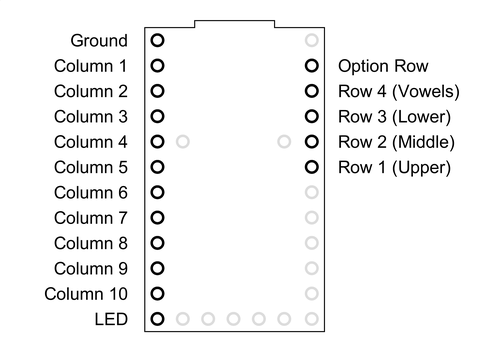

# Programming and Testing the Stenokey Circuit Board

Copyright © 2017, Mike Ady  
This file is part of the open source Stenokey project.  
This file is licensed under the Creative Commons Attribution-ShareAlike license.

It is important to check that the Stenokey circuit board is working before soldering down the key switches and the key matrix in case there is a problem that the key matrix might hide.  

The most important test that you can perform is a full visual inspection of the components on the board.  Make sure that the black bar on each and every diode is on the left.  Make sure that the indent in the rim of the LED is on the left and that the "0" positions of the option switches are also on the left.

To test the Stenokey circuit board, you will need to install the Arduino and Teensyduino software to program the Teensy micro controller.  You will need to install and configure the Plover software to fully test all of the features of the Stenokey circuit board.  Instructions are provided below. 

You will need a paper clip or a short length of wire to test with.  The paper clip or wire will be used to simulate key presses.  You will need a small slot head jeweler's screwdriver or similar screwdriver to change settings on the rotary switches.  

If you run into a problem with the circuit board, there is a section on troubleshooting towards the end of this document.  

For troubleshooting, you may find a multimeter useful.  For repair, you will need a soldering iron, solder, flux (optional), and solder wick or a desoldering tool.

## Programming and Testing

1.  Open an Internet Browser on your PC, then follow the instructions on the following web page to download and install the Arduino and Teensyduino software:

	[https://www.pjrc.com/teensy/td_download.html](https://www.pjrc.com/teensy/td_download.html)

	Be sure to install all drivers and other software that the installers ask you to install.

	If you haven't done so already, you will need to download and install the Plover application.  Open the following web page and scroll down to the bottom.  Click on "Download Latest Stable", which will redirect you to the download page:

	[http://www.openstenoproject.org/plover/](http://www.openstenoproject.org/plover/)

	Download the appropriate version for your operating system.  For some versions of Linux, you may need to build Plover from source.

2.  Clear an area on your desk to place the Stenokey circuit board on.  Move any bits of wire or other conductive materials clear away from the circuit board to avoid shorting out the board.  Place the Stenokey on top of a hand cloth or a sheet of cardboard to avoid scratching your table.  Remove any metallic jewelry on your wrists such as watches or bracelets to avoid shorting anything out while testing.

3.  Open the StenoFW.ino project in the Arduino application by double clicking on it, or run the Arduino application and open the firmware file by selecting Open...  from the File menu.  The StenoFW.ino project can be found in the Firmware/StenoFW sub-directory of the Stenokey distribution.

4.  Open the Tools menu in the Arduino application and select the menu item starting with "Board:".  Make sure that "Teensy 2.0" is selected.

5.  Open the Tools menu and select the menu item starting with "USB Type:".  Make sure that "Serial + Keyboard + Mouse + Joystick" is selected.  

6.  Click on the check mark on the toolbar to compile the Stenokey firmware.  Once the firmware has compiled successfully, the Teensy loader program will pop up.  (Don't try to upload the firmware to the Teensy using the Arduino application's Upload functionality; it won't work.)  Instead, follow the instructions presented by the Teensy application and press the button on the Teensy to start the upload process. 

7.  Make sure that the protocol switch, (SW35 or SW37) is set to "0" to select the diagnostic output protocol.  Open the Tools menu in the Arduino application and select Serial Monitor.  Use a paper clip or piece of wire to short out the two pads on one of the key switches.  You should see one or more lines with a 2 digit number appear in the Serial Monitor.  
 
	Note that the Stenokey does not emit the key code for a key press until the key is released.  When chording, the key codes are not emitted until all depressed keys are released.
  
	The first digit on each line in the Serial Monitor should be the key switch's row number (numbered 1 through 4, from top to bottom).  The second digit should be the key switch's column number (numbered 1 through A (A=10) from left to  right).  The vowel keys show the following codes, in order, from left to right:  41, 42, 46, 47.

8.  Verify the LED brightness switch (SW36 or SW37) by turning the switch to positions 0 through 7.  Position 0 is off, while position 7 is full brightness.

9.  Verify the protocol switch.  To do this, you will need to switch to each of the protocol settings then use Plover's Paper Tape display to verify that it is seeing the keystrokes that correspond to the key switches that you short out.

	The Protocol switch settings are as follows:

	0 Diagnostic protocol (view in the Serial Monitor)  
	1 Keyboard emulation (view in Plover)  
	2 Gemini protocol (view in Plover)  
	3 TXBolt protocol (view in Plover)  
	4 Procat protocol (view in Plover)  

	Note that protocol 0 is not supported by Plover, while protocol 1 is not visible from the Arduino Serial Monitor.  Also, protocols 2, 3 and 4 will generate a number of random looking characters with each key press when viewed from the Ardiuno Serial Monitor.  

	To verify that protocols 1 - 4 are being properly encoded by the rotary switch, close the Arduino Serial Monitor then open the Plover app.  On Windows, Plover must be run with administrator privilege to work properly.  For each protocol that you test, you must change both the protocol setting on the circuit board and change the protocol in Plover.  

	To set up Plover for a particular protocol, click on the Configure button on the Plover toolbar.  The Plover Configuration dialog will open.  Select the Machine tab.  Select a protocol to test with from the "Machine" drop down list box.  For the serial protocols (all protocols except for Keyboard), you will need to select the serial port and baud rate.  

	You can find out the serial port that the Teensy is connected to by opening the Arduino Tools menu.  The serial port will be listed on the line with the text "Port:".  Select the same port in Plover.  If the port does not appear in the Port drop down list box in Plover, click on the Scan button to scan for serial ports.  Finally select 115200 from the Baudrate drop down list box, then click on OK to dismiss the dialog.  Back in Plover, click on the reconnect button to make sure that Plover will see your keystrokes on the Stenokey. 

	You only need to check a few key switches on the circuit board to make sure that a particular protocol selection is working.  Plover should display the characters corresponding to the key switch pads that you short out then release.  See the following table:

	

11.  Once you have checked out everything on the Stenokey circuit board and everything is working, UNPLUG THE USB CABLE then continue with the Stenokey build instructions to complete assembly of the Stenokey. 

## Background

It is important to understand a little about how the Stenokey circuit board works to be able to troubleshoot it.

The Stenokey is a simple key switch matrix with a micro controller that reads the states of all of the switches and transmits their states to a PC.  The circuit board has wires arranged in rows and columns with a key switch and a diode wired to the intersection of most of the row and column wires.  

The micro controller scans the keys by applying a voltage to a single row wire at a time.  It reads the state of each switch in a row by checking the voltage on each column wire, one wire at a time.  Of course, the connections between the micro controller and the switches are where most of the problems with soldering the circuit board occur.

Each switch is wired in series with a diode.  The purpose of the diodes is to prevent current from flowing through the key matrix in the wrong directions when two or more keys are pressed at the same time.  The diodes allow the micro controller to scan each key switch individually, without any cross talk between the switches.

The rotary option switches work the same way as the key switches, except that each rotary switch is connected to three different column wires through three different diodes.  The micro controller reads the rotary switches in exactly the same manner as it reads the key switches.

## Troubleshooting Tips

(If you can read an electrical schematic and you have a multimeter, the Stenokey schematic is available in PDF format in the Documentation sub-directory of the Stenokey distribution.)  

1.  If you get no response from the Teensy download program when you press the reset button on the Teensy, you may have a bad connection to your PC or you may have a short somewhere that is pulling down the power to the Teensy.
	- Make sure that the USB connector is fully inserted on both ends.  
	- Try another port on your PC.
	- Try a different USB cable.
	- Verify all solder connections, and make sure that there are no solder bridges or other unwanted conductive paths.  

2.  If all of the key switches in a particular row or column are not working, you probably have a cold solder joint or even a non-existent solder joint on the Teensy end.  

	Refer to the following diagram to determine which pin or pins is the most likely culprit. 

	

	Note that the first two vowel keys are on columns 1 and 2, while the second two vowel keys are on columns 5 and 6.  

	The simplest fix, if you have liquid flux, is to apply flux to the bad joint or joints, then re-heat the joint with your soldering iron.  If you don't have flux, it is best to remove as much of the solder on the joint as possible using solder wick or a desoldering tool, then reapply fresh solder to the joint.  Be sure to check both the bottom and top solder joints on the Teensy module.
 
3.  If some key switch or switches don't work and the issues don't appear to be correlated, then the most likely problem is a cold joint on the diode that is adjacent to each problem key switch.  As mentioned previously, try to repair the problem by applying flux to the diode joints and then reheating the solder.  Alternatively, remove the solder with solder wick or a desoldering tool and resolder the joints.

	It is unlikely but it is also possible that you could have a bad diode, and you could try replacing it.  If you have a multimeter, you can verify that a diode is working by selecting the continuity/diode checking function on your meter.  The meter should show a voltage drop of about 0.6 V with the black lead on the cathode (black band) and the red lead on the anode.  With the leads swapped, the meter should show no connection.  If the cathode is not on the left, remove it and resolder it in the correct orientation.

4.  If the LED doesn't light, no matter what position the brightness rotary switch is in, then it is most likely that the LED has been installed backwards or it is burned out.  (It is also possible that the brightness rotary switch isn't working at all.  See troubleshooting tip 5, below.)

	- If you have a multimeter, you can verify that a LED is working by selecting the continuity/diode checking function on your meter.  The meter should show a voltage drop of about 1.8 V with the black lead on the cathode and the red lead on the anode.  With the leads swapped, the meter should show no connection.  If the cathode is not on the left, then the LED has been installed backwards;  if so, remove it and resolder it in the correct orientation.  
	- It is also possible that you have a cold solder joint on the LED, the resistor, or the Ground or LED pins on the Teensy module.  The simplest fix, if you have liquid flux, is to apply flux to the bad joint or joints, then re-heat each joint with your soldering iron.  If you don't have flux, it is best to remove as much of the solder on the joints as possible, using solder wick or a desoldering tool, then reapply fresh solder to the joints.  

5.  If neither of the rotary switches is working at all, then the problem is most likely a bad solder joint on the "Option Row" pin of the Teensy module.  See troubleshooting tip 2 above for further details.

6.  If one or both rotary switches are not operating correctly, then the problem is most likely a bad solder joint on either the rotary switches or their associated diodes.  Diodes D33, D34 and D35 are associated with the protocol switch (SW35 or SW37).  Diodes D38, D39 and D40 are associated with brightness switch (SW36 or SW38).  See troubleshooting tip 3 above for further details.

7.  If the Arduino software fails to build the Stenokey firmware, it is most likely an incompatibility that has arisen between the Arduino or Teensyduino libraries and the Stenokey firmware.  You can get help for the Arduino libraries on the Arduino forum.  You can get help for the Teensyduino libraries at PJRC.  You can also post an issue to the Stenokey project on Github.  

	As an alternative to building the Stenokey firmware from scratch, you can load the pre-built firmware instead.  The pre-built firmware is in the Firmware sub-directory of the Stenokey distribution in the file StenoFW.ino.hex.  To program the Teensy, open the Teensy download program and select "Open HEX File" from the program's File menu.  Open the above mentioned hex file to load it into the Teensy program.  Press the reset button on the Teensy to program it. 

8.  If shorting one key switch causes the micro controller to show two or more key presses at the same time, the problem is most likely a solder bridge on the Teensy module.  Carefully check the pins on both the top and bottom of the Teensy to make sure that excess solder isn't connecting any of the pins together.  If there is excess solder, remove it with solder wick or a desoldering tool.  If you remove too much solder, resolder the affected joints, but apply solder sparingly.

